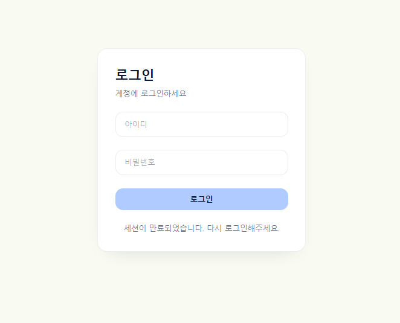
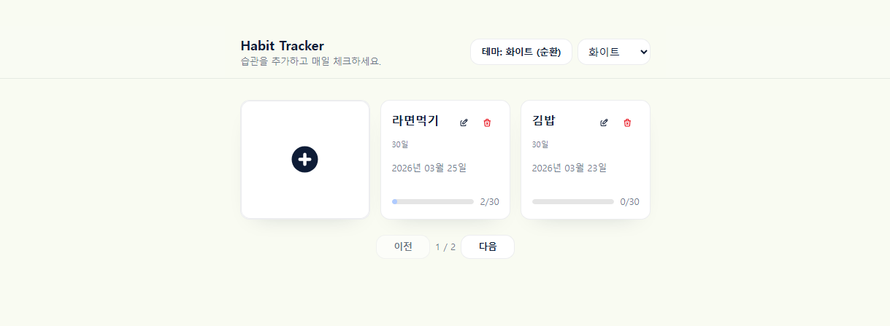
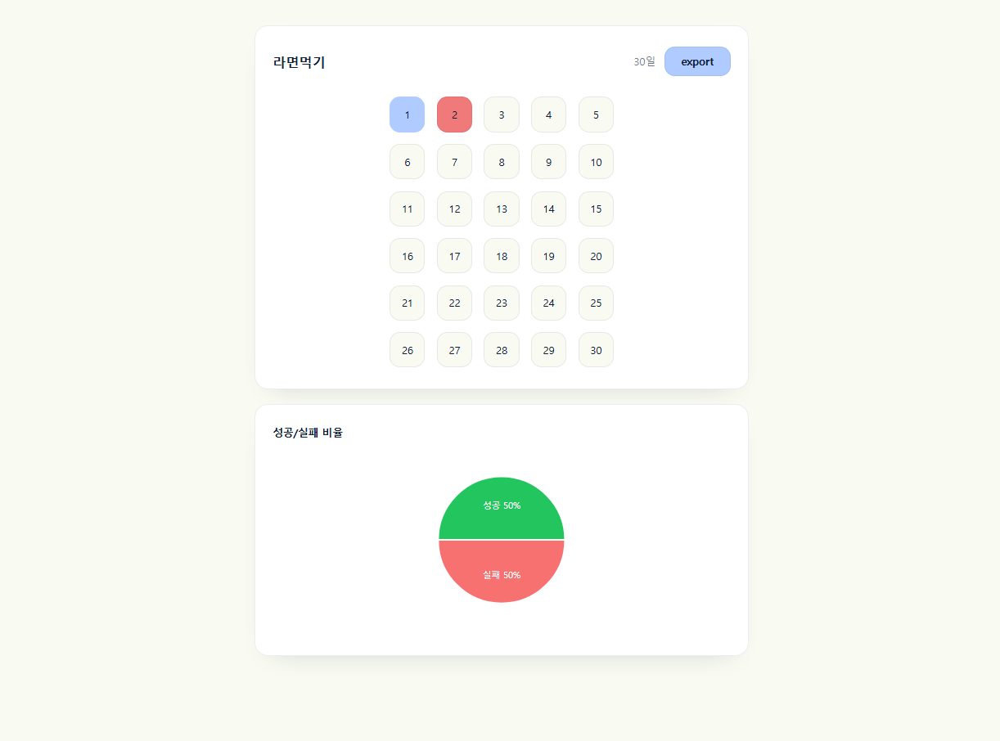
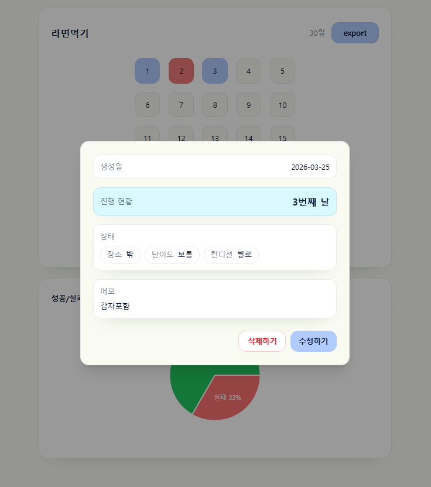
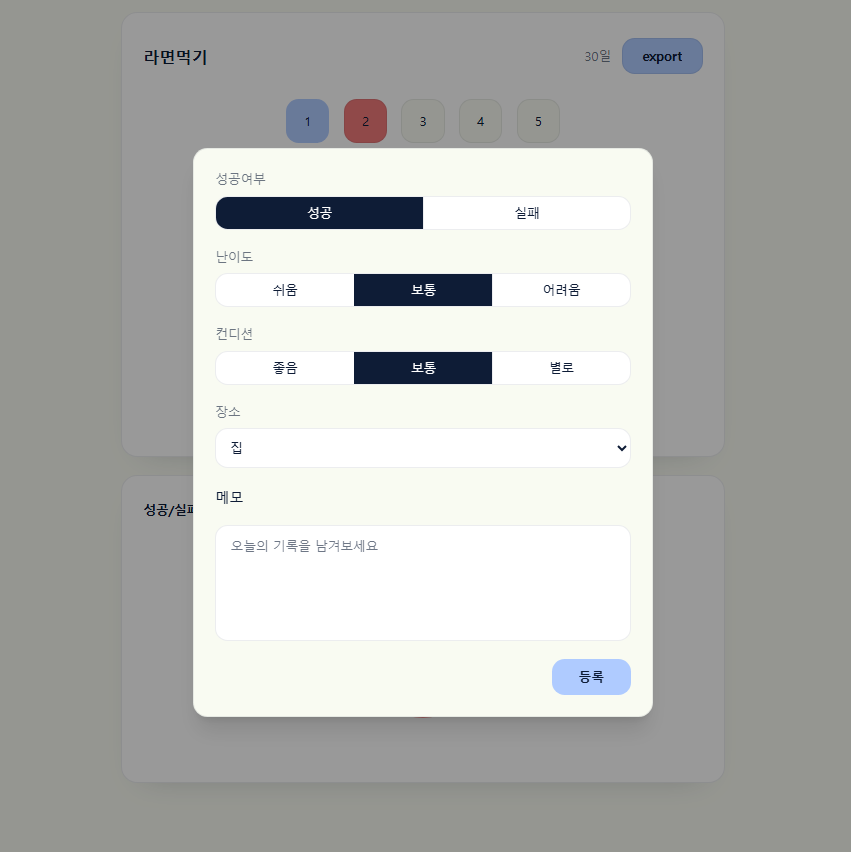

# Habit Tracker

> 습관을 등록하고 하루 단위 성공/실패를 기록한 뒤, 누적된 패턴을 차트와 CSV로 확인할 수 있는 프론트엔드 프로젝트

## 프로젝트 소개

이 프로젝트는 **“하나의 습관을 꾸준히 기록했을 때 어떤 패턴이 보일까?”** 라는 궁금증에서 시작했습니다.

출발은 단순한 기록 앱이었지만, 구현 과정에서는 단순 CRUD를 만드는 데서 멈추지 않고  
**인증 흐름**, **에러 처리 표준화**, **서버 상태와 UI 상태 분리**, **디자인 토큰 기반 테마 관리**처럼  
설명 가능한 프론트엔드 구조를 만드는 데 집중했습니다.

## Demo

배포된 서비스와 테스트 계정을 통해 주요 기능을 바로 확인할 수 있습니다.

### 배포 링크

- https://habit-tracker-seven-hazel.vercel.app/

### 테스트 계정

- ID: `testuser`
- PW: `test1234`

### 주요 화면

| Login                    | Habit List                         |
| ------------------------ | ---------------------------------- |
|  |  |

| Habit Page                         | Habit Detail Modal                                 |
| ---------------------------------- | -------------------------------------------------- |
|  |  |

| Habit Form                   |
| ---------------------------- |
|  |

> 현재는 백엔드 API 연동이 필요한 구조라 프론트엔드 단독 실행은 지원하지 않습니다.

## 주요 기능

- **로그인 기반 인증**
  - 인증된 사용자만 주요 화면에 접근할 수 있도록 구성했습니다.

- **습관 CRUD**
  - 습관을 등록, 조회, 수정, 삭제할 수 있습니다.

- **하루 기록 체크**
  - 하루 단위로 성공 / 실패를 기록할 수 있습니다.

- **기록 시각화**
  - 누적된 기록을 간단한 차트로 확인할 수 있습니다.

- **CSV Export**
  - 기록 데이터를 CSV로 내보낼 수 있습니다.

- **테마 변경**
  - 여러 테마를 전환하며 사용할 수 있습니다.

- **반응형 UI**
  - 작은 화면에서도 레이아웃이 무너지지 않도록 반응형 대응을 적용했습니다.

## 핵심 구현 포인트

### 1. API 에러 처리 표준화

요청 실패를 호출부마다 제각각 해석하지 않도록 `ApiError` 형태로 표준화했습니다.  
이를 통해 인증 오류, 권한 문제, 네트워크 오류, 타임아웃 같은 실패 상황을  
일관된 기준으로 분기할 수 있도록 정리했습니다.

### 2. 서버 상태와 UI 상태 분리

습관 목록, 습관 상세, 하루 기록처럼 서버에서 받아오는 데이터는 **TanStack Query**로 관리하고,  
화면 제어를 위한 상태는 별도 상태로 분리했습니다.

이렇게 역할을 나누면서:

- 데이터 캐싱 / 무효화 기준을 명확하게 유지하고
- UI 상태가 서버 데이터 흐름과 뒤섞이지 않도록 구성했습니다.

### 3. 디자인 토큰 기반 테마 관리

색상 값을 컴포넌트마다 직접 흩뿌리기보다  
토큰 기반으로 테마를 관리해 일관성과 확장성을 확보했습니다.

테마가 늘어나더라도 화면 전반의 스타일을 같은 기준으로 맞출 수 있도록 구성했습니다.

### 4. 인증 흐름 중앙화

401 처리를 페이지마다 분기하는 대신,  
전역 에러 처리와 라우터 가드로 인증 흐름을 한 곳에서 관리하도록 정리했습니다.

이 구조를 통해 인증 정책이 바뀌더라도 수정 범위를 줄이고,  
세션 만료 상황도 더 일관되게 대응할 수 있도록 했습니다.

## 트러블슈팅

### 1. 실패 상황을 화면마다 다르게 처리하던 문제

초기에는 API 실패 케이스를 호출부마다 다르게 다룰 여지가 있었습니다.  
이 상태에서는 오프라인, 타임아웃, 비정상 응답이 섞일 때  
사용자 경험이 들쭉날쭉해질 수 있었습니다.

이를 해결하기 위해:

- fetch 레이어에서 `ApiError`로 에러를 표준화하고
- 에러 상태에서 재시도 가능한 UI를 제공하고
- 인증 만료 시에는 로그인 흐름으로 자연스럽게 복구되도록 정리했습니다.

### 2. 인증 체크가 페이지마다 흩어져 있던 문제

초기 구조에서는 페이지별 인증 체크가 분산되어 있어  
중복 코드가 생기고 유지보수 비용이 커질 수 있었습니다.

이후:

- **전역 401 감지**
- **Protected / Public 라우트 분리**

를 적용해 인증 로직을 라우터 레벨로 끌어올렸습니다.

### 3. 작은 화면에서 차트가 레이아웃을 벗어나던 문제

기존 차트는 고정 크기 기반이라 화면 폭이 줄어들면 레이아웃을 벗어나는 문제가 있었습니다.

이를 해결하기 위해 `ResponsiveContainer`를 적용해  
부모 컨테이너 크기에 맞춰 차트가 자연스럽게 리사이즈되도록 수정했습니다.

## 기술 스택

| 역할               | 기술                    | 설명                                                |
| ------------------ | ----------------------- | --------------------------------------------------- |
| UI                 | React, TypeScript, Vite | 컴포넌트 기반 UI 구성과 타입 안정성, 빠른 개발 환경 |
| 라우팅             | React Router            | 인증 여부에 따른 라우트 분리와 접근 제어            |
| 서버 상태 관리     | TanStack Query          | 서버 데이터 조회, 캐싱, 무효화, 전역 에러 흐름 처리 |
| UI 상태 관리       | Zustand                 | 모달, 테마 등 UI 성격의 상태 관리                   |
| 폼 관리            | React Hook Form         | 입력 폼 상태 관리                                   |
| 스타일링           | Tailwind CSS            | 빠른 UI 구성과 스타일 일관성 유지                   |
| 데이터 시각화      | Recharts                | 습관 기록을 간단한 차트로 시각화                    |
| 사용자 피드백      | React Toastify          | 토스트 메시지 제공                                  |
| 품질 관리 / 자동화 | ESLint, GitHub Actions  | 코드 품질 검사와 기본 CI 자동화                     |

## 프로젝트 구조

```text
src
├─ apis
├─ components
├─ features
│  ├─ auth
│  ├─ error
│  └─ habit
├─ hooks
├─ layout
├─ router
├─ store
├─ types
├─ Home.tsx
├─ global.css
└─ main.tsx
```

- `features` 단위로 도메인을 나누고,
- `router`에서 접근 제어를 담당하고,
- `apis` / `store` / `hooks`를 역할별로 분리해 관심사를 정리했습니다.

## CI

GitHub Actions로 다음 항목을 자동 검증합니다.

- install
- lint
- build

PR과 `main` 브랜치 기준으로 기본적인 코드 품질과 빌드 가능 여부를 확인하도록 구성했습니다.

## 앞으로 보완하고 싶은 점

- 테스트 코드 보강
- 차트/통계 표현 확장
