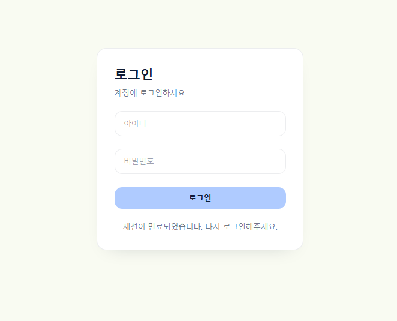
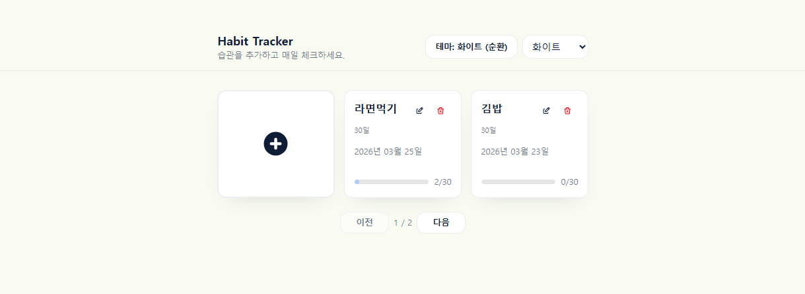
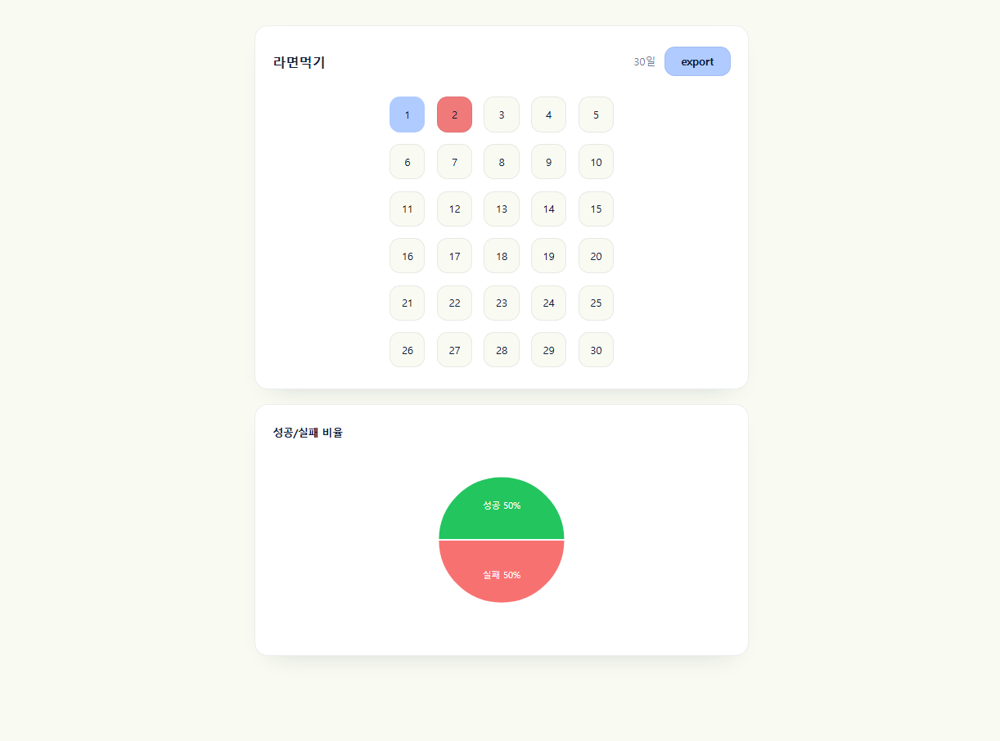
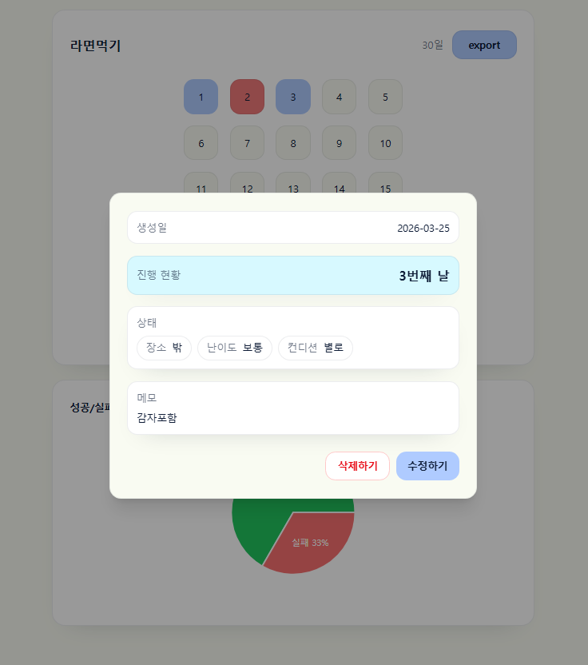
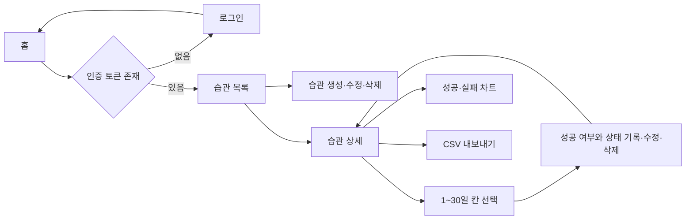
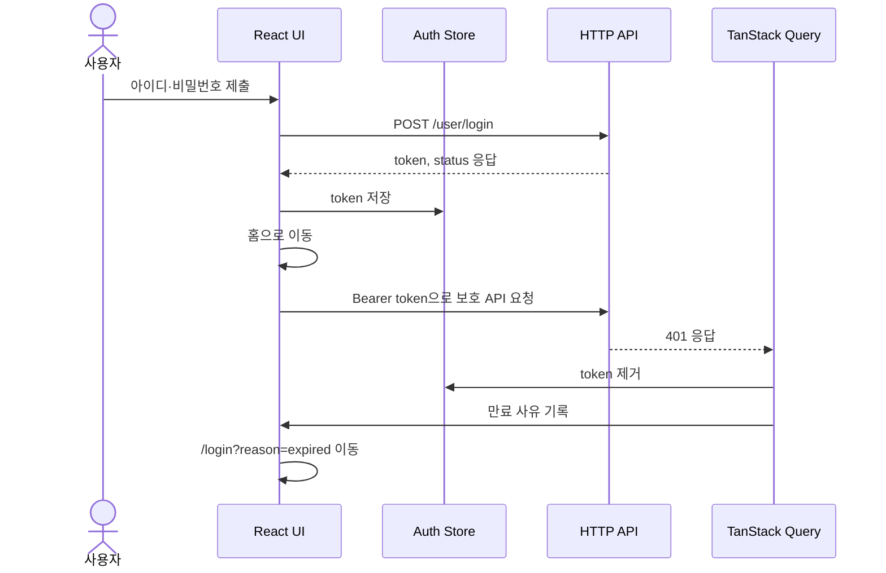

# Habit Tracker

## 프로젝트 소개

Habit Tracker는 사용자가 습관을 만들고, 1일부터 30일까지의 수행 결과를 성공·실패와 함께 기록하는 웹 애플리케이션입니다. 이 저장소는 **프론트엔드 애플리케이션**으로, 환경변수로 지정한 서버의 HTTP API를 호출해 로그인 정보, 습관, 수행 기록을 조회하고 변경합니다. 서버 내부 구현은 이 문서의 설명 범위에 포함하지 않습니다.

- Backend Repository: [링크 추가 예정]

### Demo

- 배포 주소: https://habit-tracker-seven-hazel.vercel.app/
- 테스트 계정: `testuser` / `test1234`

> 전체 기능을 사용하려면 연동된 API 서버가 필요합니다.

### 주요 화면

| 로그인 | 습관 목록 |
| --- | --- |
|  |  |

| 30일 기록 | 기록 상세 모달 |
| --- | --- |
|  |  |

## 주요 기능

- 로그인과 브라우저에 유지되는 인증 토큰 상태 관리
- 인증 여부에 따른 보호 페이지 및 로그인 전용 페이지 접근 제어
- 습관 생성·목록 조회·수정·삭제
- 습관별 30일 수행 기록 조회·생성·수정·삭제
- 성공 여부, 난이도, 컨디션, 장소, 메모 기록
- 30일 달성 수 진행률과 성공·실패 비율 차트
- 수행 기록 CSV 내보내기
- 401 인증 만료, 권한·리소스·네트워크·타임아웃 오류 처리
- 4종 테마 전환 및 반응형 레이아웃

## 기술 스택

| 기술 | 프로젝트에서의 역할 |
| --- | --- |
| React 19, TypeScript | 컴포넌트 기반 UI와 API 응답·폼 데이터 타입 정의 |
| Vite | 개발 서버, SWC 기반 React 빌드, 테스트 설정 |
| React Router | 홈·로그인·습관 목록·상세 라우팅과 인증 기반 접근 제어 |
| TanStack Query | 사용자 정보, 습관 목록·상세·수행 기록의 조회·캐시·mutation·무효화 |
| Zustand | 인증 토큰, 테마, 모달, 선택한 습관·수행일 등 클라이언트 상태 관리 |
| Fetch API | 공통 요청 함수에서 Bearer 인증 헤더, 타임아웃, 오류 변환 처리 |
| React Hook Form | 로그인, 습관, 수행 기록 폼의 입력 상태와 필수값 검증 |
| Tailwind CSS 4 | 반응형 레이아웃과 디자인 토큰 기반 4종 테마 스타일링 |
| Recharts | 수행 결과의 성공·실패 비율을 반응형 파이 차트로 표현 |
| Day.js | 화면과 CSV의 생성일·수정일 포맷 변환 |
| React Toastify | 기록 저장·삭제 등 mutation 결과 피드백 |
| Vitest, Testing Library | 습관 추가 폼의 성공·실패·필수 입력 흐름 테스트 |

## 사용자 흐름


```mermaid
flowchart LR
    A[홈] --> B{인증 토큰 존재}
    B -- 없음 --> C[로그인]
    C --> A
    B -- 있음 --> D[습관 목록]
    D --> E[습관 생성·수정·삭제]
    D --> F[습관 상세]
    F --> G[1~30일 칸 선택]
    G --> H[성공 여부와 상태 기록·수정·삭제]
    H --> F
    F --> I[성공·실패 차트]
    F --> J[CSV 내보내기]
```

로그인 성공 후 홈으로 이동하며, 홈의 습관 링크를 통해 보호된 목록에 접근합니다. 이미 로그인한 사용자가 `/login`에 접근하면 `/habit`으로 이동합니다.

## 주요 구현 내용

### 1. 서버 상태와 UI 상태 분리

**문제 또는 요구사항**

서버에서 다시 받아야 하는 데이터와 화면 조작을 위한 상태를 같은 저장소에서 관리하면 캐시 갱신 기준과 UI 생명주기가 섞일 수 있습니다.

**구현 방식**

TanStack Query는 현재 사용자(`/user/me`), 습관 목록, 습관 상세, 습관별 수행 기록을 관리합니다. Zustand는 인증 토큰과 테마의 영속 상태, 모달 열림·편집·저장 중 닫기 차단 상태, 선택한 습관과 30일 칸 인덱스를 관리합니다.

**코드상 핵심 포인트**

- `habitList`, `habitDetail(habitId)`, `habitDayList(habitId)`로 query key의 책임을 구분했습니다.
- 습관 생성·수정·삭제 성공 시 `habitList`를 무효화합니다.
- 수행 기록 저장·삭제 성공 시 해당 습관의 `habitDayList(habitId)`만 무효화해 상세 화면을 다시 동기화합니다.
- 목록과 상세 화면은 조회 실패 시 공통 오류 UI에서 `refetch`를 실행할 수 있습니다.

### 2. API 오류 표준화와 인증 만료 처리

**문제 또는 요구사항**

화면마다 HTTP 상태와 네트워크 예외를 직접 해석하면 오류 메시지와 인증 만료 처리가 달라질 수 있습니다.

**구현 방식**

공통 `fetch` 래퍼가 모든 요청에 10초 타임아웃을 적용하고, 인증 요청에는 저장된 토큰을 `Authorization: Bearer` 헤더로 전달합니다. 실패는 `ApiError`의 `UNAUTHORIZED`, `FORBIDDEN`, `NOT_FOUND`, `HTTP_ERROR`, `NETWORK_ERROR`, `TIMEOUT` 코드로 변환합니다.

**코드상 핵심 포인트**

- QueryCache와 MutationCache의 전역 `onError`가 `UNAUTHORIZED`를 감지하면 토큰을 제거하고 `sessionStorage`에 만료 사유를 기록합니다.
- 토큰 변경으로 `ProtectedLayout`이 다시 평가되면 `/login?reason=expired`로 이동하고, 로그인 화면에서 세션 만료 안내를 표시합니다.
- 401 쿼리는 재시도하지 않고, 그 밖의 쿼리는 한 번만 재시도하며 mutation은 자동 재시도하지 않습니다.
- 상세 화면은 `403`을 권한 오류 UI로, `404`를 Not Found 화면으로 분기합니다. 이는 프론트 응답 처리만 설명하며 서버의 인증 발급·검증 방식은 전제하지 않습니다.

### 3. 30일 수행 기록과 화면 동기화

**문제 또는 요구사항**

서버에는 기록이 존재하는 날만 포함될 수 있으므로, 사용자가 항상 1일부터 30일까지 동일한 화면에서 빈 날과 기록된 날을 구분할 수 있어야 합니다.

**구현 방식**

상세 화면에서 길이 30의 빈 배열을 만든 뒤, 응답의 `habitIndex`(0~29) 위치에 수행 기록을 배치합니다. 각 칸은 `SUCCESS`, `FAILED`, 미기록 상태에 따라 색상을 달리하며, 선택한 인덱스는 Zustand에 저장해 상세/입력 모달이 같은 대상을 사용합니다.

**코드상 핵심 포인트**

- 이 구현은 달력 날짜를 계산하는 방식이 아니라 **30개의 수행 순번**을 관리하는 방식입니다.
- 기록이 있으면 상세 정보를 먼저 보여주고, 수정 모드에서는 기존 값을 React Hook Form에 채웁니다. 기록이 없으면 즉시 입력 폼을 엽니다.
- 저장 요청에는 성공 여부, 난이도, 컨디션, 장소, 메모, 수행 인덱스가 포함됩니다.
- 저장·삭제 후 해당 수행 기록 쿼리를 무효화해 30칸 UI와 차트가 갱신된 서버 응답을 사용하도록 합니다.

### 4. 라우팅과 중단 없는 모달 입력 흐름

**문제 또는 요구사항**

인증이 필요한 화면의 접근을 통제하는 동시에, 모달 입력 도중 실수로 내용을 잃거나 저장 요청 중 모달을 닫는 상황을 막아야 합니다.

**구현 방식**

`ProtectedLayout`은 토큰이 없는 사용자를 로그인 페이지로 보내고 원래 접근 경로를 route state에 담습니다. `PublicOnlyLayout`은 로그인 사용자의 로그인 페이지 접근을 막습니다. 공통 모달은 포커스 관리와 작성/저장 상태에 따른 닫기 정책을 함께 처리합니다.

**코드상 핵심 포인트**

- 모달에 `role="dialog"`, `aria-modal="true"`를 적용하고 열린 뒤 첫 요소로 포커스를 이동합니다.
- Tab/Shift+Tab 포커스 트랩, ESC 닫기, 배경 클릭 닫기, 종료 후 이전 포커스 복원을 구현했습니다.
- 폼 값이 변경된 상태에서는 닫기 전 확인하고, 수행 기록 저장 중에는 ESC·배경 클릭을 포함한 닫기 동작을 차단합니다.
- 라우트가 바뀌면 남아 있는 모달 상태를 초기화하고, 모달이 열린 동안 본문 스크롤을 잠급니다.

## 상태 관리 구조

| 구분 | 사용 기술 | 역할 |
| --- | --- | --- |
| 서버 상태 | TanStack Query | 현재 사용자, 습관 목록·상세, 수행 기록 조회와 mutation 후 캐시 무효화 |
| 인증 상태 | Zustand persist | 로그인 응답의 토큰 저장·복원·초기화 |
| UI 상태 | Zustand | 테마, 모달, 편집/dirty/저장 중 상태, 선택한 습관과 수행 인덱스 |
| 폼 상태 | React Hook Form | 로그인·습관·수행 기록 입력과 필수값 검증 |
| 라우팅 | React Router | 공개/보호 라우트 분리와 인증 상태 기반 이동 |

## 인증 흐름


```mermaid
sequenceDiagram
    actor User as 사용자
    participant UI as React UI
    participant Store as Auth Store
    participant API as HTTP API
    participant Query as TanStack Query

    User->>UI: 아이디·비밀번호 제출
    UI->>API: POST /user/login
    API-->>UI: token, status 응답
    UI->>Store: token 저장
    UI->>UI: 홈으로 이동
    UI->>API: Bearer token으로 보호 API 요청
    API-->>Query: 401 응답
    Query->>Store: token 제거
    Query->>UI: 만료 사유 기록
    UI->>UI: /login?reason=expired 이동
```

토큰은 Zustand `persist` 미들웨어를 통해 브라우저 저장소에 유지됩니다. 보호 레이아웃 렌더링 시 토큰 유무를 확인하고, `RootLayout`은 토큰이 있을 때 `/user/me`를 조회합니다. 서버가 토큰을 어떻게 생성하거나 검증하는지는 이 저장소에서 확인할 수 없으므로 설명하지 않습니다.

## 데이터 시각화

`HabitPieChart`는 조회된 수행 기록을 순회해 `completed`가 `SUCCESS`인 수와 `FAILED`인 수를 계산하고, `{ name, value }` 형태의 두 데이터로 변환합니다. Recharts의 `PieChart`와 `Pie`로 비율을 표시하며 5% 미만 조각의 내부 라벨은 생략합니다. `ResponsiveContainer`와 높이별 반응형 클래스를 사용해 부모 너비에 맞추고, 기록이 없을 때는 상세 화면에 빈 기록 안내를 함께 표시합니다.

목록 카드에서는 API 응답의 `doneCount`를 `30` 기준의 `<progress>`로 표현해 습관별 달성 수를 빠르게 비교할 수 있습니다.

## CSV 내보내기

현재 조회된 습관의 수행 기록 배열을 아래 컬럼 순서로 변환합니다.

```text
생성일, 완료여부, 장소, 난이도, 컨디션, 메모, n일차, 수정일
```

생성일과 수정일은 `YYYY-MM-DD HH:mm:ss`, 수행 순번은 `habitIndex + 1`로 출력합니다. 쉼표·큰따옴표·줄바꿈이 포함된 값은 CSV 규칙에 맞게 escape하고, 한글 호환을 위해 UTF-8 BOM을 앞에 붙입니다. 이후 `Blob`과 object URL로 임시 다운로드 링크를 생성해 브라우저에서 `list.csv` 파일을 내려받고 URL을 해제합니다.

## 프로젝트 구조

```text
src/
├─ apis/                 # 환경변수와 공통 fetch·ApiError 계층
├─ components/           # 버튼, 입력, 카드, 모달, 오류 상태 등 공통 UI
├─ features/
│  ├─ auth/              # 로그인 화면과 현재 사용자 조회 API
│  ├─ error/             # Not Found 화면
│  └─ habit/             # 습관 목록·상세·차트·폼·query key·기능별 store
├─ hooks/                # 토스트 알림, CSV 내보내기 등 커스텀 훅
├─ layout/               # 공통 Outlet과 사용자 확인·토스트 컨테이너
├─ router/               # 라우트 정의와 Protected/PublicOnly Layout
├─ store/                # 인증 토큰, 테마, 공통 모달 Zustand store
├─ test/                 # Vitest DOM 테스트 설정
├─ types/                # 공통 습관 카드 타입
├─ Home.tsx
├─ global.css            # Tailwind 설정과 디자인 토큰별 테마
└─ main.tsx              # QueryClient와 애플리케이션 진입점
```

## 실행 방법

CI와 동일하게 Node.js 20 환경을 기준으로 실행할 수 있습니다.

1. 의존성을 설치합니다.

   ```bash
   npm ci
   ```

2. 프로젝트 루트의 `.env.development`에 API 주소를 설정합니다. 코드에서 사용하는 환경변수는 `VITE_API_BASE_URL` 하나입니다.

   ```env
   VITE_API_BASE_URL=https://your-api.example.com
   ```

3. 개발 서버를 실행합니다.

   ```bash
   npm run dev
   ```

검증 명령은 다음과 같습니다.

```bash
npm run lint
npm run test -- --run
npm run build
```

PR과 `main` 브랜치 push 시 GitHub Actions가 의존성 설치, lint, test, build를 순서대로 실행합니다.

## 관련 저장소

- Frontend Repository: 현재 저장소
- Backend Repository: [링크 추가 예정]

## 개선할 점

- 현재 습관 추가 폼 중심인 테스트를 인증 만료, 수행 기록 mutation, CSV 변환과 다운로드 흐름까지 확장
- 수행 기록 변경 시 목록의 `doneCount`, 습관 제목 변경 시 상세 제목도 즉시 일치하도록 관련 query key 무효화 범위 보강
- 습관 수정·삭제 mutation의 오류 피드백을 `ApiError` 기준으로 통일하고 재시도 가능한 오류 UI 보강
