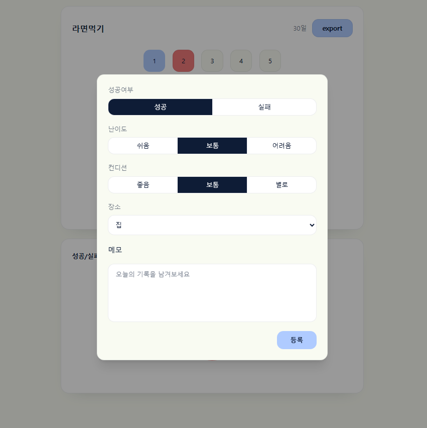

# Habit Tracker

> 습관을 등록하고 하루 단위 성공/실패를 기록한 뒤, 누적된 기록을 차트와 CSV로 확인할 수 있는 프론트엔드 프로젝트입니다.

이 프로젝트는 단순한 습관 CRUD 구현에 그치지 않고, **인증/권한 처리**, **API 에러 표준화**, **서버 상태와 UI 상태 분리**, **디자인 토큰 기반 테마 관리**처럼 사용자 흐름이 끊기기 쉬운 지점을 예측 가능하게 관리하는 데 집중했습니다.

<br />

## Demo

### 배포 링크

- https://habit-tracker-seven-hazel.vercel.app/

### 테스트 계정

- ID: `testuser`
- PW: `test1234`

> 현재 프로젝트는 백엔드 API와 함께 동작하도록 구성되어 있어 프론트엔드 단독 실행만으로는 전체 기능 확인이 어렵습니다.  
> 대신 배포 링크와 테스트 계정을 통해 주요 기능을 바로 확인할 수 있습니다.

<br />

## 주요 화면

| Login                    | Habit List                         |
| ------------------------ | ---------------------------------- |
|  |  |

| Habit Page                         | Habit Detail Modal                                 |
| ---------------------------------- | -------------------------------------------------- |
|  |  |

| Habit Form                   |
| ---------------------------- |
|  |

<br />

## 주요 기능

- **로그인 기반 인증**
  - 인증된 사용자만 주요 화면에 접근할 수 있습니다.

- **습관 CRUD**
  - 습관을 등록, 조회, 수정, 삭제할 수 있습니다.

- **하루 기록 체크**
  - 하루 단위로 습관 성공/실패를 기록할 수 있습니다.

- **기록 시각화**
  - 누적된 기록을 차트로 확인할 수 있습니다.

- **CSV Export**
  - 습관 기록 데이터를 CSV 파일로 내보낼 수 있습니다.

- **테마 변경**
  - 디자인 토큰 기반으로 여러 테마를 전환할 수 있습니다.

- **반응형 UI**
  - 작은 화면에서도 주요 화면의 레이아웃이 무너지지 않도록 대응했습니다.

<br />

## 설계 기준

이 프로젝트에서는 기능을 빠르게 추가하는 것보다, 인증 상태와 실패 상황을 일관된 기준으로 처리하는 것을 우선했습니다.

- 인증 여부 판단은 개별 페이지가 아니라 라우터 레벨에서 처리한다.
- 401 응답은 호출부마다 직접 처리하지 않고 전역 흐름으로 관리한다.
- 서버에서 받아오는 데이터는 TanStack Query가 관리한다.
- 모달, 테마처럼 서버와 무관한 화면 상태는 Zustand에서 관리한다.
- API 실패는 원본 에러를 그대로 사용하지 않고 `ApiError`로 변환한 뒤 UI에서 분기한다.
- 사용자가 오류 상황에서도 다음 행동을 이해할 수 있도록 에러 UI를 제공한다.

<br />

## 핵심 구현 포인트

### 1. 인증 흐름 중앙화

초기에는 페이지마다 인증 여부를 확인할 경우 중복 코드가 늘어나고, 인증 정책이 바뀌었을 때 여러 화면을 함께 수정해야 하는 문제가 생길 수 있다고 판단했습니다.

이를 해결하기 위해 인증 여부 판단을 라우터 레벨로 끌어올리고, 401 응답은 TanStack Query의 전역 에러 흐름에서 처리하도록 구성했습니다.

```text
사용자 접근
  └─ ProtectedLayout
      ├─ 인증 정보 있음 → 보호 페이지 접근
      └─ 인증 정보 없음 → 로그인 페이지로 이동

API 요청
  └─ 401 응답 감지
      ├─ 인증 토큰 제거
      ├─ 인증 만료 사유 저장
      └─ 로그인 페이지로 이동할 수 있는 상태로 전환
```

이 구조를 통해 인증 만료나 권한 오류 상황에서도 특정 페이지에 의존하지 않고 일관된 흐름으로 대응할 수 있도록 했습니다.

관련 코드:

- `src/router/router.tsx` - 보호 라우트와 공개 라우트 구성
- `src/router/ProtectedLayout.tsx` - 인증이 필요한 화면 접근 제어
- `src/router/PublicOnlyLayout.tsx` - 로그인 사용자 public route 접근 제어
- `src/store/useAuthTokenStore.ts` - 인증 토큰 상태 관리
- `src/main.tsx` - TanStack Query 전역 에러 처리

<br />

### 2. API 에러 처리 표준화

API 요청 실패를 각 호출부에서 직접 해석하면 화면마다 에러 처리 방식이 달라질 수 있다고 판단했습니다.

이를 방지하기 위해 fetch 레이어에서 실패 응답을 `ApiError` 형태로 변환하고, UI에서는 원본 에러가 아니라 표준화된 에러 코드를 기준으로 분기하도록 구성했습니다.

```text
API 요청 실패
  └─ fetch layer
      └─ ApiError로 변환
          ├─ UNAUTHORIZED
          ├─ FORBIDDEN
          ├─ NOT_FOUND
          ├─ HTTP_ERROR
          ├─ NETWORK_ERROR
          └─ TIMEOUT
```

에러 코드별 처리 기준은 다음과 같이 나누었습니다.

| 에러 코드       | 처리 기준                                                   |
| --------------- | ----------------------------------------------------------- |
| `UNAUTHORIZED`  | 인증 만료 또는 인증 필요 상황으로 보고 로그인 흐름으로 이동 |
| `FORBIDDEN`     | 권한 없음 메시지 표시                                       |
| `NOT_FOUND`     | 존재하지 않는 리소스 안내                                   |
| `HTTP_ERROR`    | 일반 요청 실패 안내                                         |
| `NETWORK_ERROR` | 네트워크 연결 확인 안내                                     |
| `TIMEOUT`       | 요청 시간 초과 안내                                         |

알 수 없는 오류도 기본적으로 `HTTP_ERROR`로 변환해 공통 실패 메시지를 보여주도록 했습니다.

관련 코드:

- `src/apis/fetch.ts` - `ApiError` 정의 및 요청 실패 변환
- `src/main.tsx` - 전역 `UNAUTHORIZED` 처리 및 retry 정책
- `src/components/ErrorState/ErrorStateComponent.tsx` - 공통 에러 상태 UI

<br />

### 3. 서버 상태와 UI 상태 분리

습관 목록, 습관 상세, 하루 기록처럼 서버에서 받아오는 데이터는 TanStack Query로 관리했습니다.

반면 모달 열림 여부, 테마 상태처럼 서버 데이터와 무관한 화면 제어 상태는 Zustand에서 관리했습니다.

| 상태 종류 | 관리 도구      | 예시                            |
| --------- | -------------- | ------------------------------- |
| 서버 상태 | TanStack Query | 습관 목록, 습관 상세, 하루 기록 |
| UI 상태   | Zustand        | 모달, 테마, 인증 토큰           |

이렇게 역할을 나누면서 다음 기준을 유지하려고 했습니다.

- 서버 데이터는 캐싱과 무효화 기준을 명확하게 관리한다.
- UI 상태는 서버 데이터 흐름과 섞이지 않도록 분리한다.
- 습관 생성/수정/삭제 후에는 관련 query key를 기준으로 필요한 데이터만 다시 불러온다.

특히 습관 목록, 습관 상세, 하루 기록 데이터를 query key 기준으로 나누어 관리해 서버 데이터가 변경되었을 때 화면이 오래된 상태를 보여주지 않도록 했습니다.

관련 코드:

- `src/features/habit/habitQueryKeys.tsx` - 습관 관련 query key 관리
- `src/features/habit/HabitListPage.tsx` - 습관 목록 조회 및 캐시 무효화
- `src/features/habit/Habit.tsx` - 습관 상세/기록 조회 흐름
- `src/features/habit/modal/components/HabitAddForm.tsx` - 습관 추가 후 캐시 갱신
- `src/features/habit/modal/components/HabitUpdateForm.tsx` - 습관 수정 후 캐시 갱신
- `src/features/habit/modal/HabitDayModal.tsx` - 하루 기록 저장 후 캐시 갱신
- `src/store/useModalStore.ts` - 모달 상태 관리
- `src/store/useThemeStore.ts` - 테마 상태 관리

<br />

### 4. CSV Export 처리

습관 기록은 화면에서 확인하는 것뿐 아니라 CSV 파일로 내보낼 수 있도록 구현했습니다.

CSV Export에서는 단순 문자열 연결로 끝내지 않고, Excel에서 한글이 깨지지 않도록 UTF-8 BOM을 포함했습니다. 또한 쉼표, 따옴표, 줄바꿈이 포함된 값은 CSV 형식에 맞게 escape 처리했습니다.

관련 코드:

- `src/hooks/useHabitDayCsvExport.tsx` - 습관 기록 CSV 생성 및 다운로드 처리

<br />

### 5. 디자인 토큰 기반 테마 관리

테마 기능을 구현할 때 색상 값을 컴포넌트에 직접 작성하면 테마가 늘어날수록 스타일 수정 범위가 커질 수 있다고 판단했습니다.

이를 줄이기 위해 색상 값을 토큰 기준으로 관리하고, 테마 변경 시 화면 전반의 스타일이 같은 기준으로 바뀌도록 구성했습니다.

이 구조를 통해:

- 컴포넌트 내부의 색상 의존도를 줄이고
- 테마 추가 시 수정 범위를 줄이며
- 화면 전반의 스타일 일관성을 유지할 수 있도록 했습니다.

관련 코드:

- `src/store/useThemeStore.ts`
- `src/global.css`
- `src/main.tsx`

<br />

## 트러블슈팅

### 1. 실패 상황을 화면마다 다르게 처리할 수 있던 문제

초기 구조에서는 API 실패 상황을 호출부마다 직접 처리할 수 있었습니다. 이 방식은 화면마다 에러 메시지나 복구 방식이 달라질 수 있다는 문제가 있었습니다.

특히 다음 상황을 구분해서 처리해야 했습니다.

- 인증 만료
- 권한 오류
- 존재하지 않는 리소스
- 네트워크 오류
- 타임아웃
- 알 수 없는 서버 응답

이를 해결하기 위해 fetch 레이어에서 에러를 `ApiError`로 표준화하고, UI에서는 표준화된 에러 코드를 기준으로 재로그인, 재시도, 안내 메시지를 분기하도록 수정했습니다.

결과적으로 호출부는 원본 에러의 세부 구현을 몰라도 일관된 방식으로 실패 상황을 처리할 수 있게 되었습니다.

<br />

### 2. 인증 체크가 페이지마다 흩어질 수 있던 문제

페이지마다 인증 체크를 직접 작성하면 중복 코드가 생기고 인증 정책 변경 시 수정 범위가 커질 수 있다고 판단했습니다.

이를 해결하기 위해:

- `ProtectedLayout`과 `PublicOnlyLayout`을 분리하고
- 인증이 필요한 화면은 라우터 레벨에서 접근을 제어하고
- API 요청 중 `UNAUTHORIZED`가 발생하면 전역 흐름에서 처리하도록 구성했습니다.

이후 인증 만료 상황에서도 특정 화면에만 의존하지 않고 로그인 페이지로 이동할 수 있는 흐름을 일관되게 유지할 수 있었습니다.

<br />

### 3. 작은 화면에서 차트가 레이아웃을 벗어나던 문제

기존 차트는 고정 크기에 가까운 형태로 렌더링되어 화면 폭이 줄어들 때 레이아웃을 벗어나는 문제가 있었습니다.

이를 해결하기 위해 Recharts의 `ResponsiveContainer`를 적용했고, 부모 컨테이너 크기에 맞춰 차트가 자연스럽게 리사이즈되도록 수정했습니다.

이후 작은 화면에서도 기록 시각화 영역이 레이아웃을 깨뜨리지 않도록 개선했습니다.

<br />

## 테스트

`Vitest`와 `Testing Library`를 사용해 `HabitAddForm`의 주요 사용자 흐름을 테스트했습니다.

현재 테스트는 전체 프로젝트를 포괄하기보다, 입력 폼처럼 회귀 가능성이 높은 사용자 흐름을 우선 고정하는 데 초점을 맞췄습니다.

테스트한 흐름은 다음과 같습니다.

- 습관 추가 성공
- 요청 실패 시 실패 처리
- 입력값이 비어 있을 때 제출 차단

이를 통해 폼의 기대 동작을 테스트로 고정하고, 이후 리팩토링 과정에서도 동일한 동작이 유지되는지 확인할 수 있도록 했습니다.

향후에는 다음 영역까지 테스트 범위를 확장할 예정입니다.

- 인증 만료 시 로그인 이동 흐름
- 하루 기록 체크 흐름
- CSV Export 동작
- 에러 UI 분기 처리

<br />

## CI

GitHub Actions를 사용해 PR과 `main` 브랜치 기준으로 다음 항목을 자동 검증합니다.

- install
- lint
- test
- build

이를 통해 기본적인 코드 품질, 테스트 통과 여부, 빌드 가능 여부를 확인한 뒤 변경 사항을 반영할 수 있도록 구성했습니다.

관련 코드:

- `.github/workflows/ci.yml`

<br />

## 기술 스택

| 역할               | 기술                    | 사용 이유                                          |
| ------------------ | ----------------------- | -------------------------------------------------- |
| UI                 | React, TypeScript, Vite | 컴포넌트 기반 UI 구성, 타입 안정성, 빠른 개발 환경 |
| 라우팅             | React Router            | 인증 여부에 따른 라우트 분리와 접근 제어           |
| 서버 상태 관리     | TanStack Query          | 서버 데이터 조회, 캐싱, 무효화, 에러 흐름 처리     |
| UI 상태 관리       | Zustand                 | 모달, 테마 등 클라이언트 UI 상태 관리              |
| 폼 관리            | React Hook Form         | 입력 폼 상태 관리와 검증                           |
| 스타일링           | Tailwind CSS            | 빠른 UI 구성과 스타일 일관성 유지                  |
| 데이터 시각화      | Recharts                | 습관 기록 차트 시각화                              |
| 사용자 피드백      | React Toastify          | 토스트 메시지 제공                                 |
| 테스트             | Vitest, Testing Library | 사용자 흐름 기반 테스트                            |
| 품질 관리 / 자동화 | ESLint, GitHub Actions  | 코드 품질 검사와 CI 자동 검증                      |

<br />

## 프로젝트 구조

```text
src
├─ apis
├─ components
├─ features
│  ├─ auth
│  ├─ error
│  └─ habit
├─ hooks
├─ layout
├─ router
├─ store
├─ test
├─ types
├─ Home.tsx
├─ global.css
└─ main.tsx
```

각 폴더는 다음 역할을 기준으로 나누었습니다.

| 경로             | 역할                                           |
| ---------------- | ---------------------------------------------- |
| `apis`           | API 요청 함수와 fetch 레이어 관리              |
| `components`     | 공통 UI 컴포넌트                               |
| `features/auth`  | 로그인, 인증 상태와 관련된 기능                |
| `features/error` | 에러 UI와 에러 처리 관련 기능                  |
| `features/habit` | 습관 CRUD, 기록 체크, 차트 등 핵심 도메인 기능 |
| `hooks`          | 재사용 가능한 커스텀 훅                        |
| `layout`         | 공통 레이아웃                                  |
| `router`         | 라우트 정의와 접근 제어                        |
| `store`          | Zustand 기반 UI 상태 관리                      |
| `test`           | 테스트 환경 설정 및 테스트 유틸                |
| `types`          | 공통 타입 정의                                 |

<br />

## 실행 참고 사항

이 프로젝트는 백엔드 API 연동을 전제로 합니다.

로컬에서 전체 기능을 확인하려면 API 서버 주소 설정이 필요합니다.

```env
VITE_API_BASE_URL=http://localhost:8080
```

빠른 기능 확인은 배포 링크와 테스트 계정 사용을 권장합니다.

<br />

## 앞으로 보완하고 싶은 점

- 폼 외 사용자 흐름까지 테스트 범위 확장
- 인증 만료, 기록 체크, CSV Export 테스트 추가
- 차트/통계 표현 확장
- 로컬 실행을 위한 mock API 또는 MSW 환경 구성
